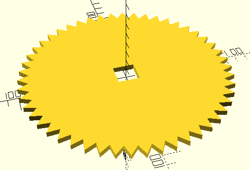

3dobjects
=========

Some simple 3D objects, created using [OpenSCAD](http://www.openscad.org/).

## Gears
A module to create gears with triangular teeth. The depth and number of teeth
and the radius of the gear are changeable.

